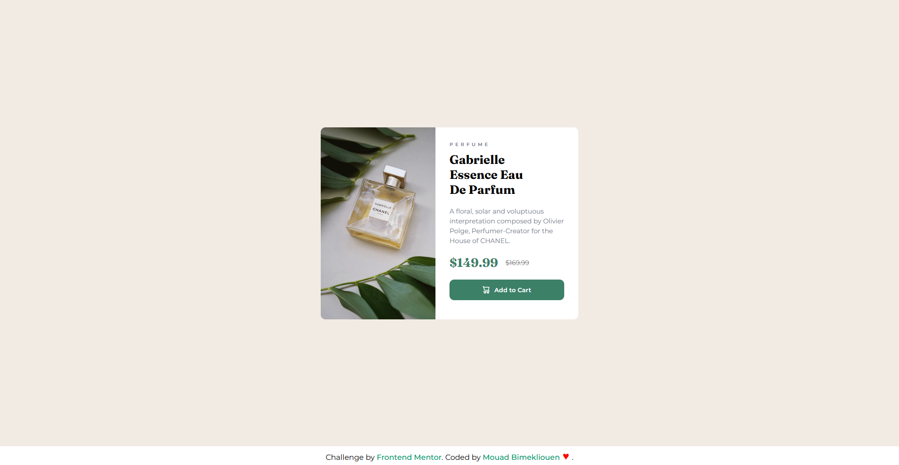

<h1>Product Preview Card component</h1>

A responsive Product Preview Card component built with HTML, CSS, and JavaScript. It displays product details such as image, title, price, and a call-to-action button, providing a clean and user-friendly layout for e-commerce websites.

<a href="https://mouadbimk.github.io/product-preview-card-component-main/">Preview</a>

